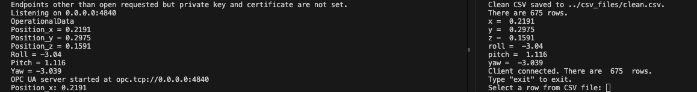
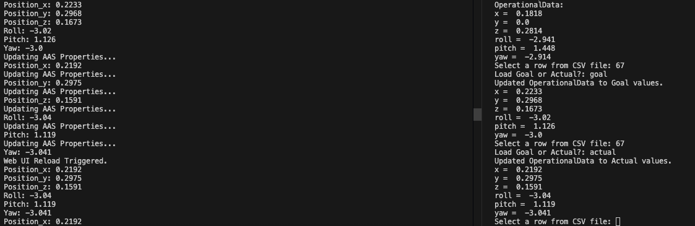

# Real Time AASX

## About the Project

This project was made for the ICT Trends class to research the robot Ned 2.
This project includes a Web UI Server, an OPC UA Server, and an OPC UA Client.

The Web UI server displays an AAS file, the OPC UA Client modifies the AAS file from an CSV file, and the OPC UA Server updates the AAS file.

## Getting Started

### Prerequites

This project requires Docker Desktop and Python 3.10.9.

* [](https://www.docker.com/)
* [](https://www.python.org/downloads/)

### Docker Setup

After downloading Docker Desktop, create the following images and volume.

1. Create the shared volume in the Terminal.

```bash
docker volume create shared_aasx
```

2. You can put your .aasx files in /aasx_files. Make a copy of your .aasx file and rename it `Updated_Your_Robot.aasx`
   Make sure to change the file names in `OpcUaServer.py` if you do this.

```python
# Path inside container
aasx_path = "/aasx_files/original/Your_Robot.aasx"
updated_aasx_path = "/aasx_files/Updated_Your_Robot.aasx"
```
   

3. Add the local files to the shared volume. 

```bash
docker run --rm \
  -v shared_aasx:/tmp_data \
  -v /Users/your_username/file_path_to/aasx_files:/tmp_local \
  busybox \
  sh -c "mkdir -p /tmp_data/original" \
  sh -c "cp /tmp_local/Your_Robot.aasx /tmp_data/original" \
  sh -c "cp /tmp_local/Updated_Your_Robot.aasx /tmp_data"
```

4. Create and run the Web UI Server. This command will create the image and container, and run the server. You can view the Web UI at `http://localhost:5001`.

```bash
docker run --rm -it \
  --name web_ui_server \
  -p 5001:5001 \
  -v shared_aasx:/AasxServerBlazor/aasxs \
  adminshellio/aasx-server-blazor-for-demo:main \
  --external-blazor http://localhost:5001 \
  --load /AasxServerBlazor/aasxs/Updated_Your_Robot.aasx
```

### OPC UA Server and Client Setup

1. Clone the repository from GitHub.

```bash
git clone https://github.com/msroque/RealTimeAasx.git
```

2. In a separate Terminal, navigate to where you saved the project. Build the OPC UA Server.
   If you are asked to allow access to other apps, allow so that the terminal can access Docker Desktop.

```bash
cd server
docker build -t opcua-server .
```

3. Run the OPC UA Server.

```bash
docker run --rm -p 4840:4840 \
  -v /var/run/docker.sock:/var/run/docker.sock \
  -v shared_aasx:/aasx_files \
  opcua-server
```

4. In a separate Terminal, run the OPC UA Client.

```bash
cd ..
cd client
python3 OpcUaClient.py
```

## Usage
1. Open `http://localhost:5001` on your browser to view the .aasx file. You will have to refresh the page when the server is reloaded.
2. Have the Terminals for the server and client next to each other so that you can see the changes on both at the same time.
3. Follow the prompts on the client terminal, and watch the changes happen on the servers.

### Server and Client - Terminals at Start Up



### Server and Client - Terminals at Update



## Retrieving Updated AASX File

To end the Terminal intructions, press `Ctrl + C`.
If you want to download the new updated .aasx file, you can download it from the shared volume on Docker Desktop, or you can run the following command.

```bash
docker run --rm \
  -v shared_aasx:/tmp_data \
  -v /Users/your_username/file_path_to/aasx_files:/tmp_local \
  busybox \
  sh -c "cp /tmp_data/Updated_Your_Robot.aasx /tmp_local/Updated_Your_Robot.aasx"
```
